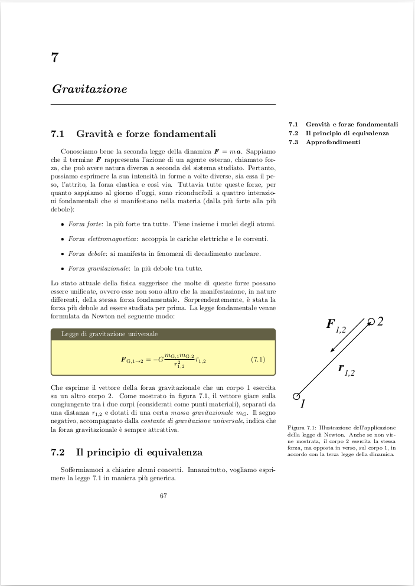

# Fisica: Meccanica Newtoniana, Termodinamica
Benvenuti nella repository degli (ennesimi) appunti di fisica per la laurea di Informatica trentina raccolti nell'anno accademico 2023-2024.

## Il template
Uno degli scopi del progetto è di mettere alla prova le potenzialità
del linguaggio tipografico LaTeX per realizzare una raccolta di appunti
elegante ed esteticamente accattivante. Ad esclusione del design di
copertina, tutto il contenuto estetico degli appunti è stato realizzato
in LaTeX.

Copertina                       | Capitolo
:------------------------------:|:-------------------------:
  |  

### Peculiarità
Ecco alcune delle qualità e caratteristiche introdotte nell'opera:
* Veste grafica generale ispirata alle _The Feynman Lectures on Physics_
* Concetti chiave delimitati da box colorati.
* Font standard AMS.
* Margine esterno ampio, per figure e tabelle.
* Per ogni capitolo, un _mini-table-of-contents_ laterale.
* Collegamenti e riferimenti interni.


## Accedere e contribuire

### _"Non mi dispiace sporcarmi le mani"_
Il progetto è completamente libero. Data la miriade di ambienti di sviluppo, tools e tutorial attualmente disponibili, non verranno mostrate qui le modalità per metter mano al codice in locale (d'altronde chi fosse
già in grado non starebbe leggendo questo paragrafo).

### _"Voglio solo il ```.pdf``` di questi appunti"_
Per coloro che intendono solamente visionare la dispensa, è possibile trovare il file
```.pdf``` aggiornato sotto il percorso ```src/```.

Segnalazioni e contributi mirati al miglioramento degli appunti (ma anche della repository) sono accolte a braccia aperte. Considerando lo stato attuale della dispensa, le Issues sono lo strumento di partenza migliore per cominciare qui su GitHub.


## Cosa uso per sviluppare questo progetto
Se desideri un breve riassunto di cosa utilizzo per creare tutto questo, ecco l'hardware e il software a mia disposizione:
1. Un umile Lenovo IdeaPad 5 15IIL05 con Ubuntu (in alternativa WSL 2 in Windows)
2. Google Drawings
3. VSCode con l'estensione _LaTeX Workshop_
4. ```make```
5. ```latexmk``` e altri pacchetti installabili da command line per compilare correttamente i file LaTeX

Si tratta di un modo di lavorare molto spartano, essenziale e dotato di supporto minimo da parte di interfacce grafiche. Se qualcuno avesse intenzione di imboccare questa strada, probabilmente il punto 5 è tra tutti il più tedioso.

Avrebbe poco senso mostrare tutta la procedura in questo file. Esistono tuttavia centinaia di forum e tutorial in rete per effettuare installazioni, eventuali troubleshooting e molti altri aiuti.

### Make
Il progetto potrebbe contenere il Makefile impiegato per compilare il documento e mantenere le direcotry del progetto pulite. Se stai utilizzando il metodo di lavoro mostrato precedentemente, ecco come il Makefile può aiutarti dalla command line:

* ```make```: compila il progetto, trasferendo i prodotti della compilazione nella cartella ```junk```. Il file pdf sarà nominato _output.pdf_ come opzione predefinita, che può essere cambiata se si lancia il comando sovrascrivendo la variabile ```TITLE```. Ad esempio, per ottenere gli appunti con il nome _fisica.pdf_, sarà necessario lanciare ```make TITLE=fisica``` (senza l'estensione).

* ```make clear```: elimina i file accessori prodotti durante la compilazione. In altri termini, elimina la cartella ```junk``` del punto precedente.

* ```make purge```: pulisce completamente la cartella ```src/```, incluso l'output pdf.