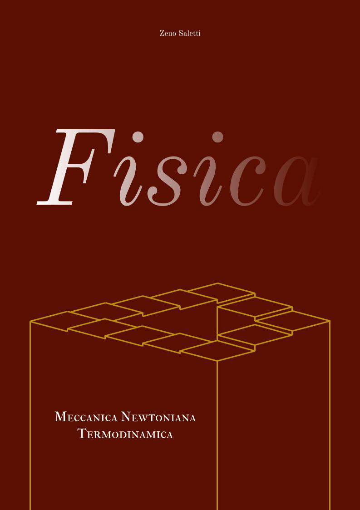
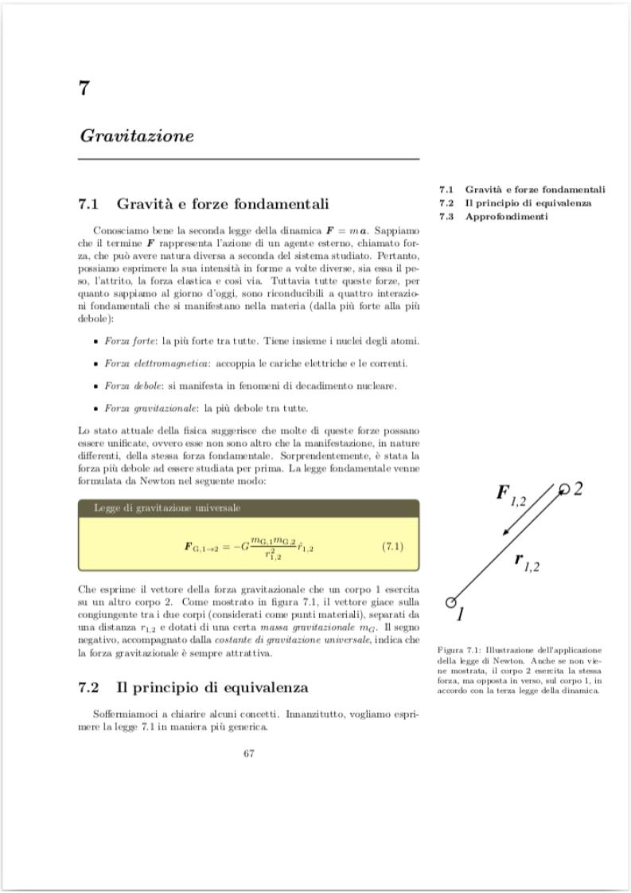

# Fisica: Meccanica Newtoniana, Termodinamica
Benvenuti nella repository degli (ennesimi) appunti di fisica per la laurea in Informatica tridentina, raccolti durante l'anno accademico 2023-2024.

## Scaricare gli appunti
La versione pubblicata si trova nelle [Release](https://github.com/zenosaltt/phy/releases/latest) (file `phy.pdf`). Il PDF viene allegato alla Release, senza versionarlo insieme ai sorgenti.

## Struttura del progetto
- `src/`: sorgenti LaTeX, stile, copertina e figure usate nel documento.
- `resources/`: materiale raccolto durante le lezioni.
- `build/phy.pdf`: PDF generato localmente; non viene versionato.
- `.github/workflows/pdf.yml`: compilazione automatica e pubblicazione delle Release.

## Compilare in locale
Con TeX Live installato, `make pdf` genera `build/phy.pdf`. Su macOS, il modo più semplice per avere `latexmk` e i pacchetti del documento è installare [MacTeX senza applicazioni grafiche](https://formulae.brew.sh/cask/mactex-no-gui):

```sh
brew install --cask mactex-no-gui
```

Dopo l'installazione, apri un nuovo terminale (oppure esegui `eval "$(/usr/libexec/path_helper)"`) e controlla con `command -v latexmk`.

Su Ubuntu servono `make`, `latexmk` e i pacchetti TeX Live del documento:

```sh
sudo apt-get update
sudo apt-get install latexmk texlive-latex-extra texlive-pictures texlive-fonts-extra texlive-lang-italian
```

Dalla radice del repository:

```sh
make pdf    # genera build/phy.pdf
make clean  # elimina PDF generato e file temporanei
```

Se preferisci non installare TeX Live sul computer, avvia Docker Desktop e usa `make pdf-docker`. Il comando usa TeX Live 2024, come la pipeline GitHub, con un'immagine disponibile sia per Apple Silicon sia per computer x86. Il primo avvio scarica un'immagine completa; le compilazioni successive la riutilizzano. Anche questo comando genera `build/phy.pdf`.

`latexmk` ripete la compilazione quando servono altri passaggi per aggiornare indice e riferimenti. I file temporanei vanno in `build/.latex/`, senza sporcare `src/`.

## Verifica e pubblicazione
Ogni pull request, push su `main` e avvio manuale del workflow **PDF** compila il documento. La pipeline conserva in cache l'installazione TeX Live per le build successive. Il PDF risultante è scaricabile dagli artefatti della relativa esecuzione nella scheda **Actions** per 7 giorni. Le build più recenti della stessa branch sostituiscono quelle ancora in corso.

Per pubblicare una versione stabile, crea e invia un tag che inizi con `v` sul commit desiderato:

```sh
git tag v1.0.0
git push origin v1.0.0
```

Il workflow ricompila quel commit e crea una GitHub Release con `phy.pdf` allegato. Pubblica il tag dopo aver verificato che la build del commit su `main` sia riuscita. Non servono segreti aggiuntivi: il job di pubblicazione usa `GITHUB_TOKEN` con il permesso `contents: write`. La prima Release renderà valido il collegamento «Release» qui sopra.

## Contribuire
Contribuire? Assolutamente sì, ma (attualmente) a queste condizioni:
* Contattando gli autori via email (`nome.cognome@studenti.unitn.it`)
* Aprendo una issue
* Sei esperto di LaTeX? Beh noi non molto; quindi che aspetti, apri una pull request! La compilazione automatica controlla che il PDF venga generato e lo allega alla build per la revisione.

Queste dispense non sono perfette e hanno bisogno di colmare alcune lacune. Scrivere appunti di questo tenore non è per nulla semplice. Ogni contributo è prezioso e non lo consideriamo tanto un favore verso gli autori (abbiamo già superato l'esame), quanto più un aiuto per gli studenti futuri.

## Il template
Uno degli scopi del progetto è di mettere alla prova le potenzialità del linguaggio tipografico LaTeX per realizzare una raccolta di appunti elegante ed esteticamente accattivante. Ad esclusione del design di copertina e di alcune figure, tutto il contenuto estetico degli appunti è stato realizzato in LaTeX.

Copertina                       | Capitolo
:------------------------------:|:-------------------------:
  |  

### Peculiarità
* Veste grafica generale ispirata alle _The Feynman Lectures on Physics_.
* Concetti chiave delimitati da box colorati.
* Font AMS.
* Per ogni capitolo, un _mini-table-of-contents_ laterale.
* Collegamenti e riferimenti interni.
